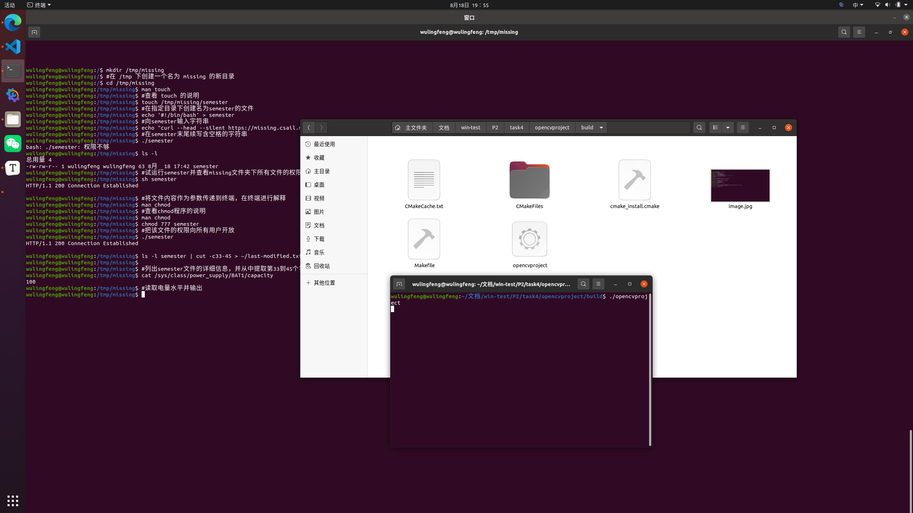

源代码：

	#include <opencv2/opencv.hpp>
	int main() {
	    cv::Mat image = cv::imread("image.jpg");
	    if(image.empty()) {
	        std::cerr << "failde open" << std::endl;
	        return -1;
	    }
	    cv::namedWindow("窗口", cv::WINDOW_AUTOSIZE);
	    cv::imshow("窗口", image);
	    cv::waitKey(0);
	    return 0;
	}

可执行文件运行截图：
