yolo8训练过程
=============

使用make sense对给定图片进行标注，得到标注文件。

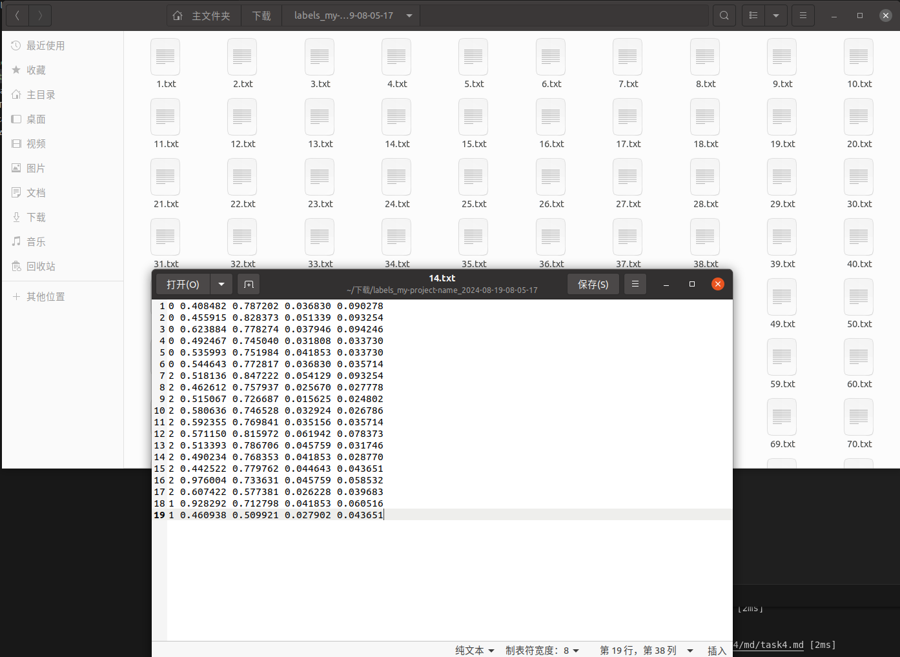

新建data目录，对标记文件及原图片进行划分，分为test，train，valid

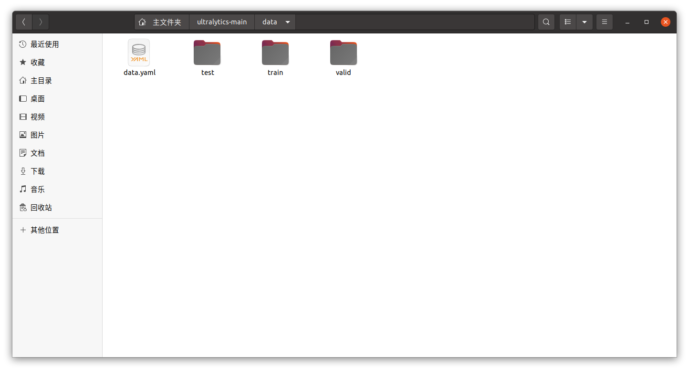

编写yaml文件

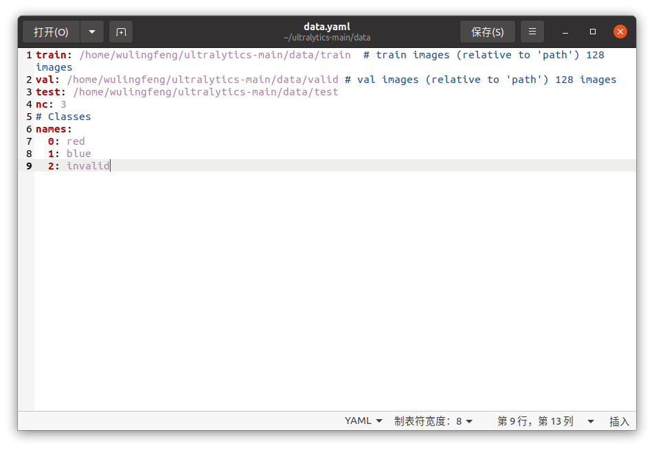

创建虚拟环境
	conda create -n y8 python=3.8
进入虚拟环境
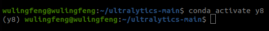
安装软件包
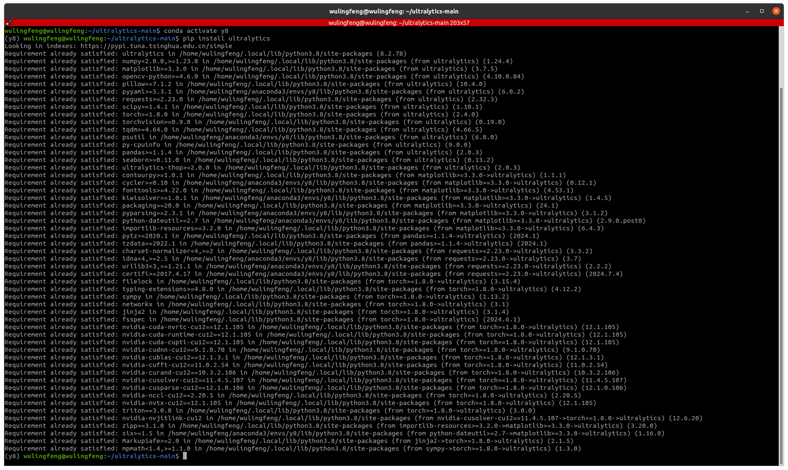
获取预训练模型下载地址前往github镜像下载
测试yolo运行情况
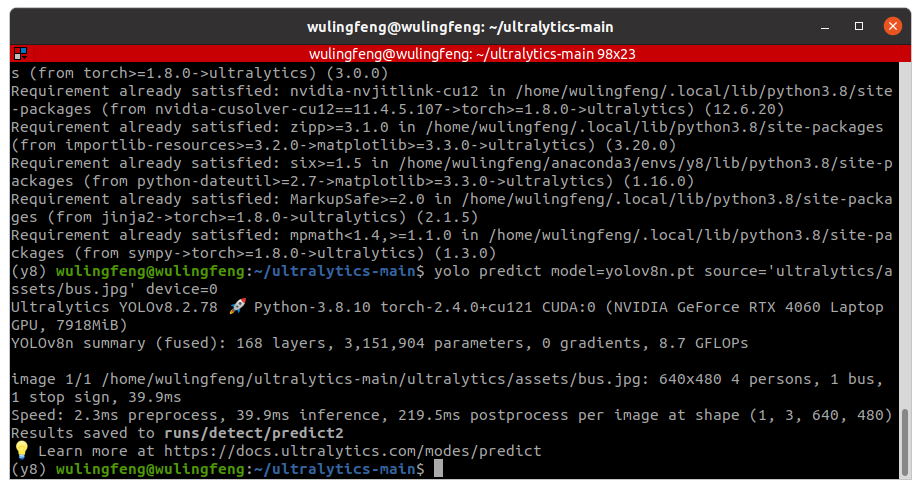

开始训练
参数：
  轮数：100
  图片大小：640
  单轮投入数量：40
  设备：gpu0
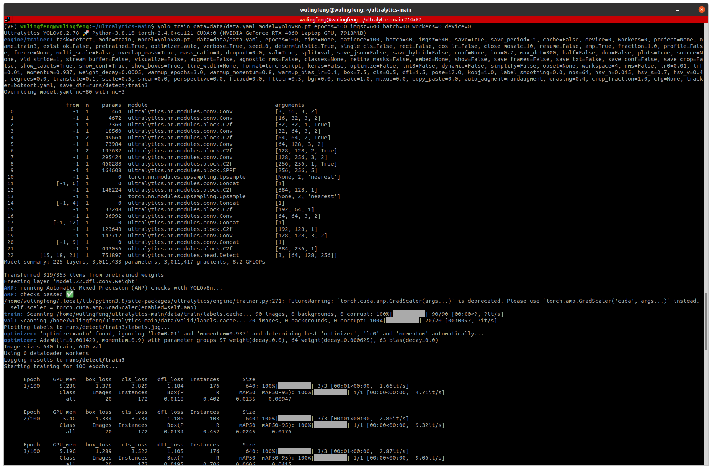

训练结果
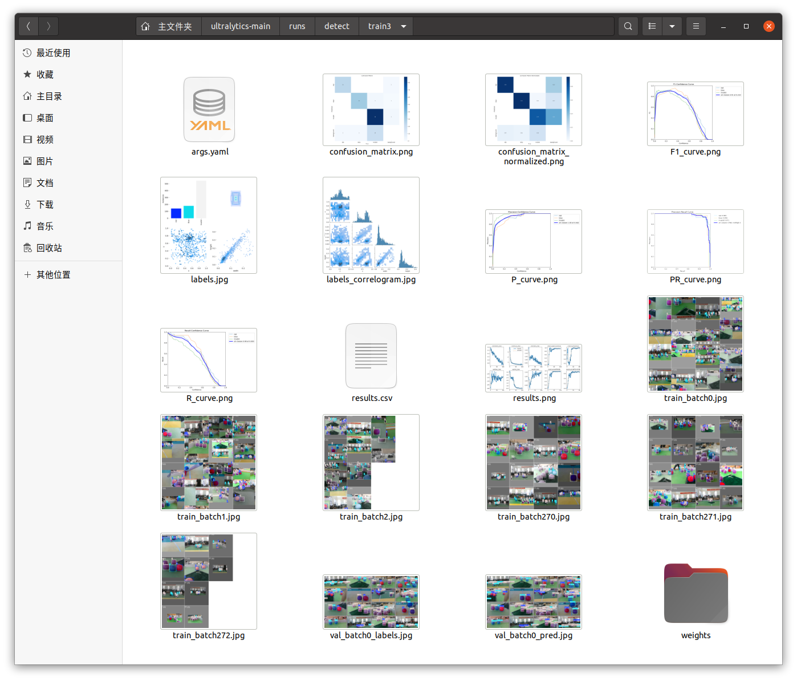

模型验证
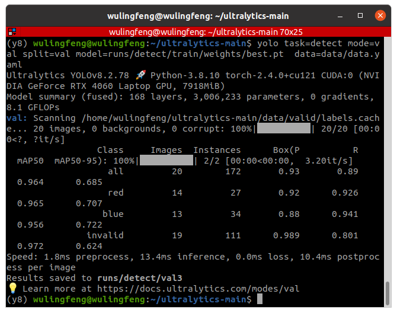
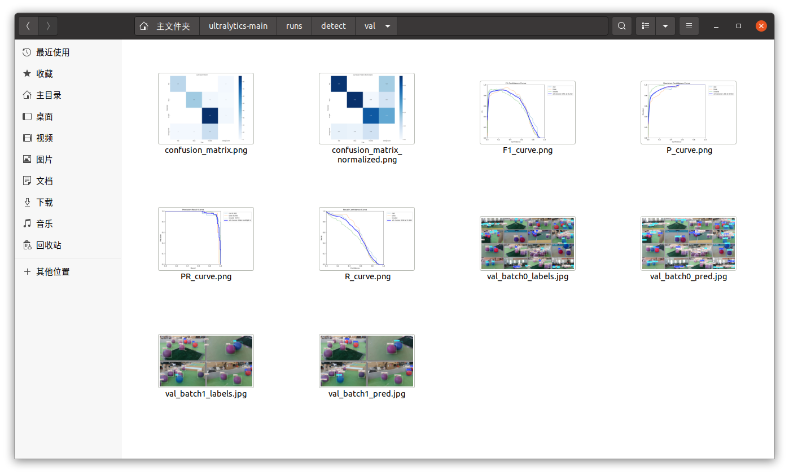
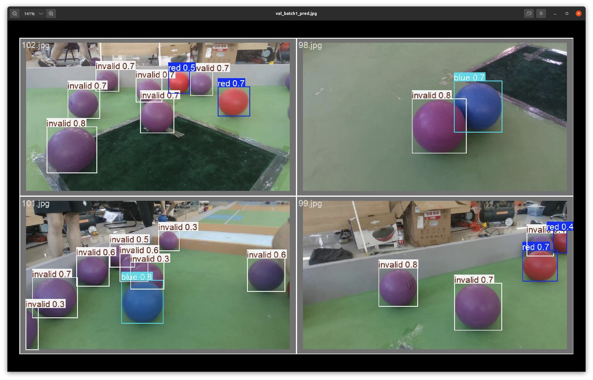